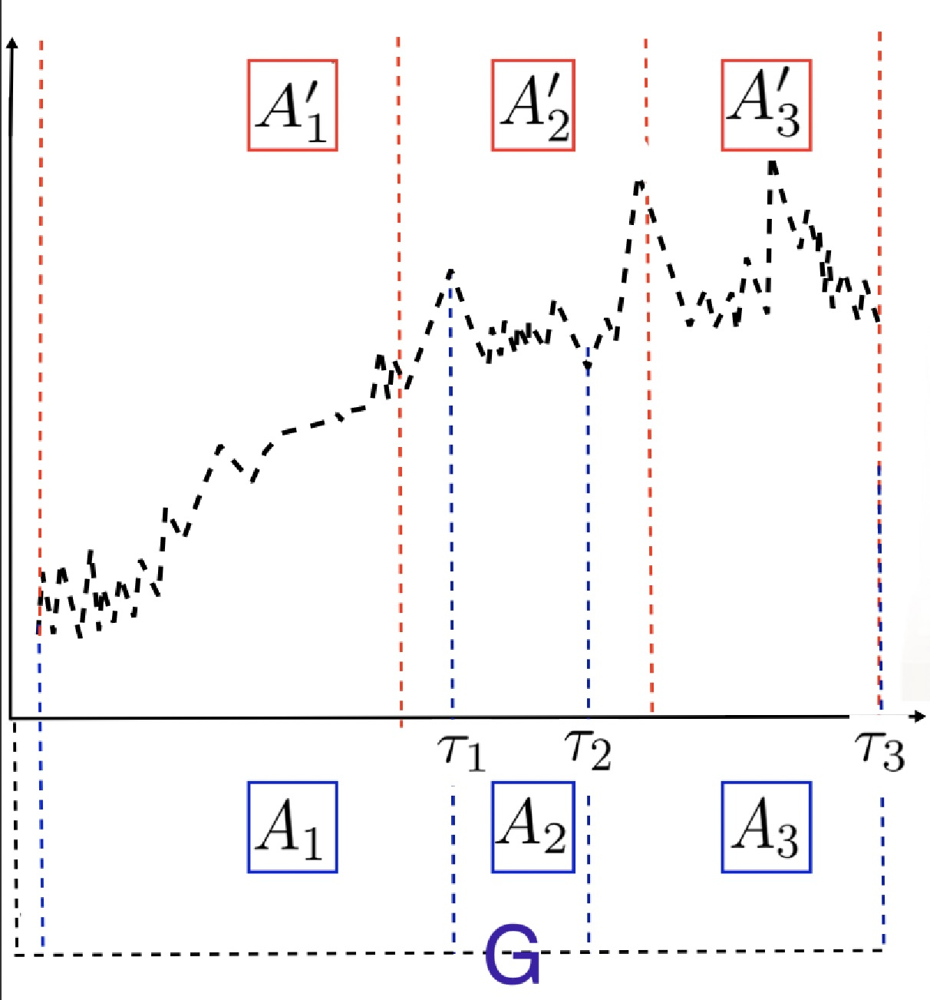

# Değişim Noktası {#Bolum2}

## Tek Değişim Noktası Tespiti

AMOC (At Most One Change), bir veri setinde yalnızca bir değişim noktasının varlığını tespit etmeye odaklanan istatistiksel bir analiz yöntemidir. Bu tür analizler genellikle zaman serileri, süreç kontrolü, finansal veriler gibi çeşitli alanlarda kullanılır. Temel hedef, veri setindeki bu değişim noktasını tanımlamak ve bu noktada meydana gelen ani değişikliği belirlemektir.

Tek değişim noktası tespiti, bir zaman serisinde veya veri setinde belirli bir anın, örneğin bir trendin başlangıcı veya bir olayın etkisi gibi bir değişiklik noktasını belirlemek için kullanılır[@lykou2020change]. Bu analiz genellikle istatistiksel yöntemler, matematiksel modeller veya makine öğrenimi algoritmaları kullanılarak gerçekleştirilir. Bu yöntemler, veri setindeki değişim noktasının istatistiksel olarak anlamlı olup olmadığını değerlendirir ve belirli bir ölçüye dayanarak değişim noktasını tanımlar. Bu tür analizler, anormal durumları tespit etmek, süreçlerdeki değişiklikleri anlamak veya zaman içindeki önemli olayları belirlemek gibi bir dizi uygulama alanında kullanılır. Örneğin, endüstriyel süreçlerde bir makinenin arızasının başlangıcını belirlemek veya finansal piyasalardaki bir trend değişikliğini saptamak gibi durumlar, tek değişim noktası tespiti analizine örnek olabilir. Bu yöntemler, veri analizi ve karar verme süreçlerinde bilinçli ve stratejik adımlar atılmasına yardımcı olabilir, çünkü belirli bir değişim noktasının tanımlanması, olayların anlaşılmasını ve gelecekteki trendlerin tahmin edilmesini destekleyebilir.

Tek bir değişim noktasının tespiti için hipotez testi bir olasılık oranı tabanlı yaklaşımla formüle edilebilir. Burada, H0 null hipotezi, değişim noktasının olmadığına (m = 0) karşılık gelirken, alternatif hipotez H1 tek bir değişim noktasına (m = 1) karşılık gelir.

Bu hipotezi test etmek için olasılık oranı test istatistiği, genel bir hipotez tabanlı yaklaşımı kullanır. İlk olarak, @hinkley1970 tarafından önerilen bu yöntem, asimptotik dağılımı türetilen bir olasılık tabanlı yaklaşımı benimser. Bu yaklaşım, normal olarak dağılmış gözlemler içindeki ortalama değişikliği için olasılık oranı test istatistiğini hesaplar.

@jengupta1987 tarafından yapılan genişletme ile bu olasılık tabanlı yaklaşım, normal olarak dağılmış gözlemler içindeki varyans değişiklikleri için de geçerli bir test istatistiği sağlar.

Bu yöntemler, belirli bir değişim noktasının varlığını istatistiksel olarak değerlendirmek ve bu değişim noktasının ne zaman gerçekleştiğini belirlemek için kullanılır. Bu analizler, veri setindeki belirli bir noktadaki değişikliklerin anlamlılığını değerlendirerek, değişim noktasının varlığını istatistiksel olarak doğrulamaya yöneliktir.

Null hipotezi için maksimum log-olabilirlik, $\log p(y_{1:n}|\hat{\theta})$ şeklinde ifade edilir, burada $p(\cdot)$ verilerin dağılımıyla ilişkilendirilen olasılık yoğunluk fonksiyonudur ve $\hat{\theta}$ parametrelerin maksimum olabilirlik tahminidir.

Alternatif hipotez altında, $\tau_1$ ile bir değişim noktası içeren bir modeli ele alalım, burada $\tau_1 \in {1, 2, \dots, n - 1}$. Bu durumda, belirli bir $\tau_1$ için maksimum log-olabilirlik şu şekildedir: $ML(\tau_1) = \log p(y_{1:\tau_1}|\hat{\theta}_1) + \log p(y_{(\tau_1+1):n}|\hat{\theta}_2)$. Değişim noktasının doğası göz önüne alındığında, alternatif hipotez altındaki maksimum log-olabilirlik değeri basitçe $\max{\tau_1} ML(\tau_1)$ olarak ifade edilir, burada maksimum tüm olası değişim noktası konumları için alınır. Test istatistiği şu şekildedir: $\lambda = 2\tau_1 ML(\tau_1) - \log p(y_{1:n}|\hat{\theta})_{\max}$.

Bu test, $\lambda > c$ ise null hipotezi reddedilir şeklinde bir eşik değeri $c$ seçerek yapılır. Eğer null hipotezi reddedilirse, yani bir değişim noktası algılanırsa, onun pozisyonunu $\hat{\tau}_1$ olarak tahmin ederiz, bu değer $ML(\tau_1)$’i maksimize eden $\tau_1$ değeridir. Bu parametre için uygun değer $c$ henüz açık bir araştırma sorusudur ve farklı değişim tipleri altında $p$ değerleri ve diğer bilgi kriterleri oluşturan birkaç yazar bulunmaktadır [@guyon1999; @chen2000; @lavielle2005; @birge2007].

Açıkça görülmektedir ki, olabilirlik test istatistiği basitçe $m$ segmentlerinin her biri için olasılığı toplamak suretiyle birden fazla değişime genişletilebilir. Sorun, tüm olası $\tau_{1:m}$ kombinasyonları üzerinde $ML(\tau_{1:m})$’in maksimumunu belirlemeye dönüşür.

## Birden Fazla Değişim Noktası Tespiti

Birden fazla değişim noktasının (Multi change points) belirlenmesi, bir veri setinde meydana gelen yapısal değişiklikleri tespit etme sürecini ifade eder. Bu analiz, veri setinin farklı segmentlere bölünmesi ve her bir segmentteki değişim noktalarının tanımlanması yoluyla gerçekleştirilir. Değişim noktaları, verinin genel özelliklerinde veya desenlerinde beklenmeyen değişiklikleri temsil eder.

Özellikle zaman serilerinde birden fazla değişim noktasının belirlenmesi, farklı dönemlerde farklı trendlerin veya desenlerin varlığını anlamak açısından önemlidir. Bu tür analizler, endüstriyel süreçlerde, finansal piyasalarda veya epidemiyolojik veriler gibi farklı alanlarda meydana gelen önemli olayları veya dönemleri belirlemek için kullanılabilir.

Bu tür analizler genellikle istatistiksel yöntemler, matematiksel modeller veya makine öğrenimi algoritmaları kullanılarak gerçekleştirilir. Birden fazla değişim noktası tespiti, veri setindeki karmaşık yapısal değişiklikleri belirleme ve anlama amacı taşır. Bu da kullanıcılara önemli olayları tespit etme ve veri setinin farklı bölümlerindeki değişiklikleri anlama imkânı sağlar. Bu analizler, veri setinin farklı segmentlerine ayrılmasını sağlayarak, her bir segmentteki farklı özellikleri ve eğilimleri anlamak için bir yol sunar. Bu da karar verme süreçlerinde daha bilinçli ve stratejik adımlar atılmasına yardımcı olabilir.

Belirli bir zaman serisi veya sinyal akışındaki birden fazla değişim noktasını verimli ve doğru bir şekilde belirleyebilmek için literatürde yaygın olarak kullanılan bir yöntem, maliyet fonksiyonunu (C) minimize ederek birden çok değişim noktasının konumunu belirlemektir. Bu yöntemde, aşırı uyumu önlemek için bir ceza terimi $\beta f(m)$ ile birlikte maliyet fonksiyonunun toplamı minimize edilmeye çalışılır. Formülü şu şekilde ifade edebiliriz: $\sum_{i=1}^{m+1} C(y(\tau_{i-1}+1):\tau_i) + \beta f(m)$

Bu denklem, değişiklik noktaları ($y(\tau_{i-1}+1)$ ile $\tau_i$ arasındaki segmentler) için maliyet fonksiyonunun toplamını ve aşırı uyumu önlemek için ceza terimini içerir. Bu yöntem, veri setini birden çok bölüme bölmek (maliyet fonksiyonu tarafından belirlenen) ile aşırı karmaşıklığı veya fazla uyumu önlemeye yönelik ceza terimi arasında bir denge kurarak birden fazla değişim noktasını etkili bir şekilde bulmayı amaçlar.

Literatürde birden fazla değişim noktasını belirleme konusunda en yaygın yöntem, bir segment için bir maliyet fonksiyonunu (genellikle negatif log olasılık gibi) minimize etmek ve aşırı uyumlanmayı engellemek için bir ceza terimi (c'nin birden fazla değişim noktası versiyonu olan $\beta f(m)$) kullanmaktır. Bu, aynı zamanda benimsediğimiz ve eşlik eden pakette kullandığımız yaklaşımdır. Bu minimize işlemini gerçekleştirmek için bir kaba kuvvet yöntemi, $2n-1$ çözümü düşünerek, $m$ bilindiğinde $n-1$m'ye indirgenir.

### İkili Segmentasyon Algoritması

İkili segmentasyon algoritması (BinSeg), değişim noktası literatüründe kullanılan en köklü arama yöntemidir. İkili segmentasyon arama algoritmasının erken uygulamaları arasında [@sen1975tests; @scott1974cluster] bulunmaktadır.

İkili segmentasyon, herhangi bir tek değişim noktası yöntemini ardışık olarak farklı veri setlerinde tekrarlayarak çoklu değişim noktalarına genişletmek için kullanılabilir. İlk olarak, tek bir değişim noktası test istatistiğini tüm veri setine uygular. $y_{1},y_{2},...,y_{n}$ şeklindeki veri seti üzerinde bir başlangıç noktası belirlenir. Bu başlangıç noktası, veri setinin ortalaması, medyanı veya başka bir özelliği olabilir. Belirlenen başlangıç noktasında bir değişim noktası testi yapılır. Bu test, veri setini iki alt küme olarak böldüğünde, oluşan alt kümelerin toplam maliyetinin belirli bir kritere göre düşük olup olmadığını kontrol eder, yani bir $\tau$'nin aşağıdaki koşulu sağlayıp sağlamadığını test eder:

$$C(y_{1:\tau}) + C(y_{(\tau+1):n}) + \beta < C(y_{1:n})$$

Burada:


\begin{itemize}
\item \textbf{C}: Bir segment için maliyet fonksiyonu
\item \textbf{$y_{1:\tau}$}: Başlangıçtan değişim noktasına kadar olan veri seti
\item \textbf{$y_{(\tau+1):n}$}: Değişim noktasından sona kadar olan veri seti
\item \textbf{$\beta$}: Aşırı uyum karşısında koruma sağlayan ceza terimi
\end{itemize}


Eğer bu koşul sağlanmıyorsa, o zaman herhangi bir değişim noktası tespit edilememiştir ve algoritma durur. Aksi takdirde veri, belirlenen değişim noktasından önce ve sonra olmak üzere iki segmente bölünür. Tek değişim noktası tespit yöntemi, değişiklikten önce ve sonra iki yeni segmente de tekrarlanır. Her iki segmentte de değişim noktaları belirlenirse, bunları yeni belirlenen değişim noktasında daha fazla segmentlere böler ve her yeni segmente değişim noktası tespit yöntemini uygular. Bu süreç, verinin herhangi bir bölümünde değişim noktası bulunamayana kadar devam eder.

Çoklu değişim noktalarını belirlemek için yaygın olarak kullanılan bir yaklaşım, aşağıdaki ifadeyi minimize etmektir:

$$\sum_{i=1}^{m+1} C(y(\tau_{i-1}+1):\tau_i) + \beta f(m)$$

Burada, $C$ bir segment için bir maliyet fonksiyonu ve $\beta f(m)$ aşırı uyum karşısında koruma sağlayan bir ceza terimidir.

İkili segmentasyon, herhangi bir değişim noktasının konumu önceden belirlenmiş değişim noktalarına bağlı olduğu için ($f(m) = m$ olarak) yukarıdaki denklemin yaklaşık bir minimize edilmesidir. Algoritmanın her adımı, bu denklemi azaltıyorsa ek bir değişim noktası eklemeye çalışır. İkili segmentasyon algoritmasının avantajı, $n$'nin veri uzunluğu olduğu durumda $O(n)$ hesaplama maliyeti ile uygulanabilen hızlı bir algoritma olmasıdır. Ancak, $C$'yi uygun bir şekilde seçmek zor olabilir ve farklı $C$ seçimleri, değişim noktalarının sayısının tahmininde önemli farklara neden olabilir.

### Prophet

Facebook tarafından 2017'de önerilen Prophet tahmin modeli [@taylor2018forecasting] , aynı anda birden fazla mevsimsellik dönemini modelleyebilir. Güçlü tahmin yeteneklerinin yanı sıra, Prophet aynı zamanda büyük aykırı değerlere ve trendlerdeki kaymalara sahip günlük periyodik verileri işlemede de başarılıdır.[@zhao2018day].

Prophet algoritması, uzun dönem zaman serilerinde belirli bir konumda değişen eğilimi bulmak için kullanılır.Değişim noktalarının tespit edilmesinde iyi tahmin edilen sonuçlar -gerçek değişim noktasına yakın veya eşit olunan durum - potansiyel değişim noktaları olarak belirlenir. Bu durumu takiben zaman boyutu kullanılarak potansiyel değişim noktaları tespit edilir ve gerçek değişim noktası bulunur.

Prophet algoritması, zaman serisi hakkında alan bilgisine sahip analistler tarafından sezgisel olarak ayarlanabilen, yorumlanabilir parametrelere sahip modüler bir regresyon modelidir. Her bir zaman serisini trend, mevsimsellik ve tatiller olmak üzere üç ana bileşene ayırır, aşağıdaki denklemde gösterildiği gibi:

$$ y(t) = g(t) + s(t) + h(t) + \epsilon_t $$

Burada, $g(t)$ zaman serisinin değerindeki periyodik olmayan değişimleri modelleyen trend fonksiyonunu, $s(t)$ periyodik değişimleri (örneğin, haftalık ve yıllık mevsimsellik) ve $h(t)$ potansiyel olarak düzensiz zamanlarda gerçekleşen tatillerin etkilerini temsil eder. Hata terimi $\epsilon_t$, model tarafından karşılanmayan herhangi bir özgün değişimi temsil eder ve normal olarak dağıldığı varsayılır.

Prophet algoritması kullanıldığında, potansiyel değişim noktaları otomatik olarak tespit edilebilir. Prophet algoritması çok küçük değişiklikleri tespit edebilir. Zaman boyutundaki potansiyel değişim noktalarını ayırt eder ve gerçek değişim noktasıyla, potansiyel değişim arasında minimum değişim oranına sahip olan noktaları bulur.

### PELT

PELT (Pruned Exact Linear Time) algoritması [@killick2012optimal] tarafından geliştirilmiştir. Bu algoritma, zaman serisindeki değişim noktalarını tespit etmektedir ve bu değişim noktalarını tespit ederken belirli bir maliyet fonksiyonunu minimize etmeyi amaçlar.

Değişim noktası analizi, genel anlamda, bir veri seti içerisinde istatistiksel özelliklerin değiştiği noktaların belirlenmesidir. Daha resmi olarak, $y_{1:n} = (y_1, \ldots, y_n)$ şeklinde sıralı bir veri dizisine sahiptir.

Model, konumlarıyla birlikte bir dizi değişim noktasına (m) sahip olacaktır: $\tau_{1:m} = (t_1, \ldots, t_m)$. Her değişim noktası konumu 1 ile $n - 1$ dahil arasında bir tam sayıdır.

$$ \tau_0 = 0 $$ ve $\tau_{m+1} = n$'yi tanımlıyor ve değişim noktalarının $\tau_i < \tau_j$ ancak ve ancak $i < j$ olacak şekilde sıralandığı varsayılmaktadır. Sonuç olarak m değişim noktası, verileri $m + 1$ parçaya bölecek ve i'inci parça $y(\tau_{i-1}+1):\tau_i$'yi içerecektir.

$$ m+1 \sum_{i=1} [C(y(\tau_{i-1}+1):\tau_i)] + \beta f (m). $$

Burada $C$, bir segment için bir maliyet fonksiyonu ve $\beta f(m)$, aşırı uyuma (overfitting) karşı koruma amaçlı bir ceza terimidir.

Başlangıçta, tüm zaman noktaları aday değişim noktaları olarak seçilir. Genellikle, zaman serisinin başlangıcı ve sonu da bu aday değişim noktaları arasına dahil edilir. Aday değişim noktaları sırayla ele alınır. Her bir aday değişim noktası için bir budama koşulu kontrol edilir. Bu koşul, değişim noktasının gelecekteki bir zamanda optimal bir değişim noktası olma olasılığını değerlendirir. Koşulu sağlamayan aday değişim noktaları budanır, yani gelecekteki değerlendirmelerden çıkarılır.

Budamanın özü, Algoritma 1'in her yinelemede gerçekleştirilen minimizasyondan asla minimum olamayacak olan $t$ değerlerini çıkarmaktır.

Aşağıdaki teorem bu tür budamanın yapılabileceği basit bir koşulu verir.

**Teorem 1:** Bir gözlem dizisine bir değişim noktası tanıtıldığında, dizinin maliyeti $C$ azalmaktadır. Daha formal bir ifadeyle, $t < s < T$ için tüm $t$ değerleri için bir $K$ sabiti var kabul edilmektedir.

#### Optimal Bölütleme

Girdi: $y_i \in \mathbb{R}$ olmak üzere $(y_1, y_2, \ldots, y_n)$ formundaki bir veri kümesi. Uyumun ölçüsü olarak $C(\cdot)$ ve değişim noktalarının sayısına veya konumuna bağlı olmayan bir ceza sabiti $\beta$ kullanılır.

Başlatma: $n$ = verinin uzunluğu olsun ve $F(0) = -\beta$, $cp(0) = NULL$ olarak ayarlayın.

Yineleme için $T^* = 1, \ldots, n$

1.  Hesapla $F(T^*) = \min_{0 \leq s < T^*} [F(s) + C(y_{s+1}:T^*) + \beta]$.

2.  $\tau' = \arg \min_{0 \leq s < T^*} [F(s) + C(y_{s+1}:T^*) + \beta]$ olsun.

3.  $cp(T^*) = (cp(\tau'), T^*)$ olarak ayarlayın.

$cp(n)$'de kaydedilen değişim noktalarını çıktı olarak verin.

\textbf{Aşağıdaki teorem bu tür budamanın yapılabileceği basit bir koşulu verir.}

\textbf{Teorem 1:} Bir gözlem dizisine bir değişim noktası tanıtıldığında, dizinin maliyeti $\mathcal{C}$ azalmaktadır. Daha formal bir ifadeyle, $t < s < T$ için tüm $t$ değerleri için bir $K$ sabiti var kabul edilmektedir.

$$
\mathcal{C}(y_{1:t}) + \mathcal{C}(y_{t+1:T}) + K \leq \mathcal{C}(y_{1:T}).
$$

Eğer

$$
F(t) + \mathcal{C}(y_{t+1:a}) + K \geq F(s)
$$

#### PELT Yöntemi

Girdi: $y_i \in \mathbb{R}$ olmak üzere $(y_1, y_2, \ldots, y_n)$ formundaki bir veri kümesi. Uyumun ölçüsü olarak $C(\cdot)$ ve değişim noktalarının sayısına veya konumuna bağlı olmayan bir ceza sabiti $\beta$ kullanılır.

Başlatma: $n$ = verinin uzunluğu olsun ve $F(0) = -\beta$, $cp(0) = NULL$, $R_1 = \{0\}$ olarak ayarlayın.

Yineleme için $T^* = 1, \ldots, n$

1.  Hesapla $F(T^*) = \min_{T \in R_{T^*-1}} [F(T) + C(y_{T+1}:T^*) + \beta]$.

2.  $\tau^+ = \arg \min_{T \in R_{T^*-1}} [F(T) + C(y_{T+1}:T^*) + \beta]$ olsun.

3.  $cp(T^*) = [cp(\tau^+), T^+]$ olarak ayarlayın.

4.  $R_{T^*+1} = \{T \in R_{T^*-1} - \{T^*\} : F(T) + C(y_{T+1}:T^*) + K \leq F(T^*)\}$ olarak ayarlayın.

$cp(n)$'de kaydedilen değişim noktalarını çıktı olarak verin.

PELT yönteminin teorik hesaplama maliyeti incelendiğinde, değişim noktası modelleri ve cezaların en önemli sınıfına odaklanılır ve yöntemin veri noktalarının sayısına göre doğrusal bir hesaplama maliyetine sahip olması için yeterli koşullar sağlanır.

Odaklanılan durum, segment parametrelerinin segmentler arasında bağımsız olduğu ve bir segment için maliyet fonksiyonunun o segmentteki verinin maksimum log-olabilirlik değerinin eksi olarak alındığı modeller kümesidir.

Daha formal olarak, sonuçlar yöntemin beklenen hesaplama maliyeti ile ilgilidir ve bu maliyetin analiz edilen veri noktalarının sayısına nasıl bağlı olduğunu ele almaktadır. Bu amaçla, veri oluşturma süreci için temel bir stokastik model tanımlanır. Özellikle, bu süreci pozitif tamsayılı zaman noktaları üzerine tanımlanır ve ardından bu süreç tarafından üretilen ilk $n$ veri noktasının analizini ele alınır.

Elde edilen sonuç, belirli bir segmentle ilişkilendirilmiş parametrelerin $\pi(\theta)$ yoğunluk fonksiyonuna sahip olduğunu varsayar. Gösterim basitliği açısından, bir segmentin parametresi $\theta$ verildiğinde, segment içindeki veri noktalarının $\pi(\theta)$ yoğunluk fonksiyonuna sahip olduğunu varsayılır, ancak bir segment içindeki bağımlılıklara genişletmeler basittir. Son olarak, önceki belirtildiği gibi maliyet fonksiyonu, maksimum log-olabilirliğin eksi değerine dayanacaktır.

$$ C(y_{t+1:T}) = - \max_{\theta} \sum_{i=t+1}^{T} \log f(y_i|\theta). $$ (5)

Bu kayıp fonksiyonu için (4) içinde $K = 0$ dikkate alınmalıdır. Bu nedenle, PELT'teki budama, sadece ceza sabiti $\beta$'nın seçimine bağlı olacaktır.

-   Ayrıca, her bir segmentin uzunluğu için bir model olarak bir değişim noktasının konumu için stokastik bir model gereklidir. Değişim noktası pozisyonları $\tau_1$, $\tau_2$, . . . ise, segment uzunluklarını $S_1 = \tau_1$ olarak tanımlanırsa ve $i = 2, 3, . . .$ için $S_i = \tau_i - \tau_{i-1}$.
-   $S_i$, bağımsız ve aynı dağılıma(iid) sahip rastgele değişken $S$'in bağımsız ve aynı dağılıma sahip kopyaları olarak kabul edilir. Ayrıca, $S_1$, $S_2$, . . . , segmentlerle ilişkilendirilmiş parametrelerle bağımsızdır.

\textbf{Teorem 3.2:} Beklenen log-olabilirliği maksimize eden değeri tanımlayalım:

$$ \theta^* = \arg\max \int \int f(y|\theta)f(y|\theta_0)dy\pi(\theta_0)d\theta_0. $$

$\theta_i$ gerçek parametre olsun ve bu parametreyi içeren segmentle ilişkilendirilsin. $\hat{\theta}_n$, verilen veri $y_{1:n}$ ve tek bir segment varsayımına dayanarak $\theta$ için en büyük olabilirlik tahminidir:

$$ \hat{\theta}_n = \arg\max_{\theta} \sum_{i=1}^n \log f(y_i|\theta). $$

$B_n = \sum_{i=1}^n \left| \log f(y_i|\theta_n) - \log f(y_i|\theta^*) \right|$ ifadesine sahip olarak, $E(B_n) = o(n)$ ve $E[(B_n - E(B_n))^4] = O(n^2)$ olmaktadır.


(A2)

$$ \mathbb{E} \left( \log(f(Y|\theta)) - \log(f(Y|\theta^{'})) \right) < \infty; $$


(A3)

$$ E(S^4) < \infty; \text{ ve} $$

(A4)

$$ E\left(\log f(Y|A) - \log f(Y|O')\right) > \frac{\beta}{E(S')} $$

Burada, $S$ beklenen segment uzunluğudur, $n$ veri noktasını analiz etmek için PELT'in beklenen CPU maliyeti $L_n$ için bazı sabit $L < \infty$ ile yukarıdan sınırlıdır.

$\Theta_i$, $y_i^{'}$yi içeren segmentle ilişkilendirilmiş gerçek parametre olsun ve $\hat{\Theta}_n$, veri $y_{1:n}$ ve tek bir segment varsayımıyla verilen $\Theta$ için maksimum olabilirlik tahminidir: (let $q_i$)

$S$'nin beklenen segment uzunluğu olduğu durumda, $n$ veri noktasını analiz etmek için PELT'in beklenen CPU maliyeti, $L$ sabiti için yukarıda $L_n$ ile sınırlanır. (where $S$ is the)

Teorem 3.2'nin Şartları (A1) ve (A2), zayıf teknik şartlardır. Örneğin, maksimum olabilirlik tahminleri içi $n$ genel asimptotik sonuçlar, $B_n = Op(1)$ verecektir, ve (A1), $B_n$'nin $O(n^{1/2})$ veya daha büyük değerleri alma olasılığını kontrol eden biraz daha güçlü bir koşuldur.

Diğer iki koşul daha önemlidir. Koşul (A3), büyük segmentlerin olasılığını kontrol etmek için gereklidir. (A3)'ün önemli bir sonucu, değişim noktalarının beklenen sayısının $n$ ile lineer olarak artacak olmasıdır. Son olarak, (A4) koşulu doğaldır çünkü gerçek değişim noktası ve parametre değerleri ile elde edilen beklenen cezalandırılmış olabilirlik değerinin, veriye tek bir segment uydurulduğunda ve segment parametresi $\Theta^*$ ile elde edildiğinde beklenen cezalandırılmış olabilirlik değerinden daha büyük olması gerekir. Tüm durumlarda, algoritmanın en kötü durum karmaşıklığı, budama yapılmadığı durumdur ve hesaplama maliyeti $O(n^2)$ olacaktır.

### Parçalı Regresyon

Parçalı veya kesik çizgili modeller, yanıt ile bir veya daha fazla açıklayıcı değişken arasındaki ilişkilerin parçalı doğrusal olduğu, yani iki veya daha fazla değişkenle temsil edildiği regresyon modelleridir.Bu ilişkiler, genellikle bilinmeyen değerlerde birleştirilen iki veya daha fazla düz çizgi tarafından temsil edilir, bu değerlere genellikle kırılma noktaları, değişim noktaları veya birleşim noktaları denir. Bu yöntemde bağımsız değişken, aralıklara bölünür ve her bir aralığa ayrı bir çizgi segmenti uyarlanır.Parçalı regresyon analizi ayrıca çeşitli bağımsız değişkenlerle yapılan çok değişkenli veriler üzerinde de gerçekleştirilebilir. Parçalı regresyon analizi, bağımsız değişkenlerin belirli gruplara ayrıldığı durumlarda, bu gruplardaki değişkenler arasındaki ilişkilerin farklı olduğuna inanıldığında kullanışlıdır. Bu parçalar arasındaki sınırlar, değişim noktaları olarak adlandırılır.

Matematiksel olarak, model şu şekilde ifade edilebilir:

$y = \beta_{0i} + \beta_{1i} x + \epsilon$

Bu denklemde, $\beta_{0i}$ ve $\beta_{1i}$ sırasıyla i-inci segmentin kesişim noktası ve eğimini temsil eder.

Parçalı regresyon, ekonomi, biyoloji, çevre bilimleri, epidemiyoloji gibi çeşitli alanlarda kullanılır.Kalite iyileştirme müdahaleleriyle ilgili çalışmalarda parçalı regresyon analizlerinin kullanımına dair birçok örnek yayınlanmıştır.

Temel bir parçalı regresyon analizinde zaman periyodu müdahale öncesi ve sonrası parçalara bölünür ve her parçada ayrı ayrı kesişme noktaları ve eğimler tahmin edilir. Müdahaleden önce ve sonra kesişmelerde ve eğimlerdeki değişiklikleri test etmek için istatistiksel testler gerçekleştirilir. Veriler ve model spesifikasyonunda bazı basit değişikliklerle parçalı regresyon analizi, genellikle standart istatistiksel yazılım paketlerinde kolayca uygulanabilir. Genellikle, zaman içinde alınan gözlemler ilişkilidir, bu nedenle otokorelasyonu hesaba katmak için genellikle ek bir düzeltme yapılması gerekir.

Parçalı doğrusal regresyon, parçalı regresyonun doğrusal regresyon kullanılarak elde edilen bir alt türüdür.İki parçalı doğrusal regresyon, bir değişim noktası ile ayrılmış iki parçayla, değişken bir etkenin (x) yanıt fonksiyonunun ($Y_{r}$) ani bir değişikliğini nicelendirmek için kullanışlı olabilir. Değişim noktası, yanıt fonksiyonunun kritik, güvenli veya eşik değeri olarak yorumlanabilir; bu değerin ötesinde veya altında (istenmeyen) etkiler meydana gelebilir. Değişim noktası, karar verme süreçlerinde önemlidir.

Her bir parça için ayrı ayrı uygulanan en küçük kareler yöntemi, iki regresyon çizgisini veriye mümkün olduğunca iyi uyacak şekilde oluştururken, gözlemlenen (y) ve hesaplanan (Yr) bağımlı değişken değerleri arasındaki farkın karesini en aza indirir. Bu yöntemle şu iki denklem elde edilir:

$Yr = A1.x+K1 <BP$ (değişim noktası için)

$Yr = A2.x+K2 >BP$ (değişim noktası için)

Burada:

\begin{itemize}
\item $Y_{r}$, x'in belirli bir değeri için beklenen (tahmin edilen) y değeridir;
\item A1 ve A2 regresyon katsayılarıdır (çizgi segmentinin eğimini gösterir);
\item K1 ve K2 regresyon sabitleridir (y-ekseninde kesişimi gösterir).
\end{itemize}


Bu yöntem aynı zamanda iki korelasyon katsayısı (R) da üretir:

$R_{1}^{2}=1-{\frac {\sum (y-Y_{r})^{2}}{\sum (y-Y_{a1})^{2}}}$ x\<BP (değişim noktası için)

ve

$R_{2}^{2}=1-{\frac {\sum (y-Y_{r})^{2}}{\sum (y-Y_{a2})^{2}}}$ x\>BP (değişim noktası için)

Burada:

\begin{itemize}
\item $\sum (y-Y_{r})^{2}$: Her bir parça için minimize edilmiş SSD'yi temsil eder.
\item $Y_{a1}$ ve $Y_{a2}$: İlgili parçalarda y'nin ortalamasıdır.
\end{itemize}


En uygun eğilimi belirlemede, bu eğilimin güvenilir (anlamlı) olduğundan emin olmak için istatistiksel testler gerçekleştirilmelidir.

Eğer anlamlı bir değişim noktası tespit edilemezse, değişim noktası olmadan bir regresyona geçilmelidir. Aşağıdaki istatistiksel testler, eğilim türünü belirlemek için kullanılır:


\begin{enumerate}
\item \textbf{A1 ve A2'nin Anlamlılığı:} A1 ve A2'nin anlamlılığı, A1 ve A2'nin standart hata SE'si ve Student'ün t-distribution'ı kullanılarak belirlenir.
\item \textbf{A1 ve A2'nin Farkının Anlamlılığı:} A1 ve A2'nin farkının anlamlılığı, farklarının standart hatası SE ve Student'ün t-distribution'ı kullanılarak belirlenir.
\item \textbf{Y1 ve Y2'nin Farkının Anlamlılığı:} Y1 ve Y2'nin farkının anlamlılığı, farklarının standart hatası SE ve Student'ün t-distribution'ı kullanılarak belirlenir.
\item \textbf{Değişim Noktasının Varlığını Test Etme:} Sözde skor testi, parçalı çizginin tahminini gerektirmez ve kırılma noktasının varlığını test etmek için daha formal bir istatistiksel yaklaşımdır.
\end{enumerate}


Ayrıca, tüm verilerin korelasyon katsayısı ($R_{a}$), belirleme katsayısı veya açıklama katsayısı, regresyon fonksiyonlarının güven aralıkları ve ANOVA analizi kullanılmaktadır.

$C_{d}$ katsayısı, tüm veri seti için belirlenen şartlar altında maksimize edilmesi gereken bir belirleme katsayısıdır ve şu formülle hesaplanır:

<!-- $C_{d}=1-{\sum (y-Y_{r})^{2} \over \sum (y-Y_{a})^{2}}$ -->
<!-- over kullanımı uyarı çıkmasına neden oluyor \frac ile yazılmalı  -->
$C_{d} = 1 - \frac{\sum (y-Y_{r})^{2}}{\sum (y-Y_{a})^{2}}$

Burada $Y_{r}$, önceki regresyon denklemlerine göre beklenen (tahmin edilen) y değeridir ve $Y_{a}$, tüm y değerlerinin ortalamasıdır.

$C_{d}$ katsayısı, 0 ile 1 arasında değer alır. Saf, parçalanmamış doğrusal regresyonda, $C_{d}$ ve $R_{a}^2$ değerleri eşittir. Parçalı regresyonda, $C_{d}$'nin $R_{a}^2$'den anlamlı derecede büyük olması, parçalanmanın haklı olduğunu gösterir.

Değişim noktasının en uygun değeri, $C_{d}$ katsayısının maksimum olduğu noktada bulunabilir.

## Kapsama Ölçütü

```{r, echo=FALSE,fig.cap="Kapsama Ölçütü" ,out.width="400px", out.height="400px"}

```

Değişim noktası tespiti için metrikler, kümeleme metrikleri veya sınıflandırma metrikleri uyarlanarak kullanılabilir. Bu bölümde kümeleme analizinden uyarlanarak hesaplanan kapsama ölçütü (cover metric) tanıtılmıştır.

K işaretleyici sayısı $(k=1,...,K)$ olmak üzere, $k.$ işaretleyici tarafından belirlenen değişim noktalarının konumları $T_k = \{\tau_1,...,\tau_{n_k}\}$ ile gösterilir. $\tau_i < \tau_j$ koşulunu sağlamak için $i < j$ olmalıdır. $T_k$, $[1, T]$ aralığını $A_j$ adı verilen ayrık kümeler halinde bölen bir bölüm $G_k$'yi belirtir. Burada $A_j$, $j = 1,...,n_k +1$ için $\tau_{j} -1$'den $\tau_{j} -1$'e olan parçadır. Notasyon kolaylığı için $\tau_0 = 1$ ve $\tau_{n_k+1} = T +1$ kullanılır.

İki küme için $A, A' \subseteq [1, T ]$ Jaccard indeksi, ayrıca iki kümenin kesişimi bölü birleşimi olarak da bilinir. $$J(A,A')=\frac{|A\cap A'|}{|A\cup A'|}$$

Kapsama metriğini $G$ ve $G'$ olarak tanımlarız.

$$C(G,G') = \frac{1}{T} \sum_{A \in G} |A| \cdot \max_{A' \in G'} J(A,A')$$.

İşaretleyiciler tarafından sağlanan temel doğruluk bölümlerinin $\{G_k\}_{k=1}^K$, bir algoritma tarafından verilen bir $S$ bölümü için, $C(G_k,S)$ ortalamasını hesaplayarak işaretleyicilerin tek bir performansını değerlendirilir.

## F1 Puanı

Değişim noktası tespiti algoritmalarını değerlendirmeye ilişkin alternatif bir görüş, değişim noktası tespitini bir sınıflandırma problemi olarak kabul eder. Burada her bir gözlem “değişim noktası ” veya “tipik gözlem” sınıflarına ait olarak değerlendirilir [@killick2012optimal; @aminikhanghahi2017survey]. $X$, bir tespit algoritması ile bulunan değişim noktası konumları olsun. $T^* = \cup T_k$, tüm işaretleyicilerin birleşik kümesidir. Değişim noktalarının gerçek konumları $T$ için, algoritmalar ile elde edilen gerçek pozitifler $TP(T, X)$ olarak tanımlanır ($\tau \in T$).Bu küme içindeki her bir $\tau$, $|\tau - x| \leq M$ koşulunu sağlayan en az bir $x \in X$ için bulunur. Ancak bir $\tau \in T$ için yalnızca bir $x \in X$ kullanılır. Bu çalışmada $ M = 5$ alınmıştır.

Doğruluk değeri, 0 ile 1 arasındadır. Doğru tahmin edilen değerlerin, tüm değerlere bölünmesi ile elde edilmektedir.  Doğruluk değeri 1’e yaklaştıkça başarı artmaktadır[@kelle2022mqtt].

$$Dogruluk = \frac{(GP + GN)}{(GP + GN + FP + FN)}$$

Değişim noktalarının sayısı genellikle serideki gözlem sayısından çok küçüktür. Bu nedenle doğruluk oranı gibi ölçütler oldukça çarpık olacaktır. Bu durumda F puanı kullanılabilir. F puanında, bir algoritmanın performansı kesinlik ($P$) (doğru tespit edilen değişim noktalarının tespit edilen değişim noktalarının sayısına oranı) ve duyarlılık (doğru tespit edilen değişim noktalarının gerçek değişim noktalarının sayısına oranı) kullanılarak ölçülür ($\beta = 1$ olarak varsayılır).

$$F_{\beta} = \frac{(1 + \beta^2) \cdot P \cdot R}{(\beta^2 \cdot P) + R}$$

```{r, echo=FALSE,fig.cap="Yanılgı matrisi",out.width="357px", out.height="109px"}

```

-   Gerçek Pozitif (GP): Doğru olarak tahmin edilen, gerçekte de doğru olan değerler,
-   Gerçek Negatif (GN): Yanlış olarak tahmin edilen, gerçekte de yanlış olan değerler,
-   Yanlış Pozitif (YP): Doğru olarak tahmin edilen, gerçekte yanlış olan değerler,
-   Yanlış Negatif (YN): Yanlış olarak tahmin edilen, gerçekte doğru olan değerleri ifade etmektedir.


Duyarlılık (recall), doğru olarak tahmin etmemiz gereken değerlerin, ne kadarını doğru tahmin ettiğimizi belirtmektedir. Duyarlılık değeri, gerçekte doğru olan ve doğru olarak tahmin edilen değerlerin, tüm doğru değerlere bölünmesi ile elde edilmektedir[@kelle2022mqtt].

$$Duyarlilik =  \frac{GP}{(GP + YN)}$$

Kesinlik (precision), doğru olarak tahmin ettiğimiz değerlerin, ne kadarının gerçekte doğru olduğunu göstermektedir. Kesinlik değeri, gerçekte doğru olan ve doğru olarak tahmin edilen değerlerin, doğru olarak tahmin edilen tüm değerlere bölünmesi ile elde edilmektedir[@kelle2022mqtt].

$$Kesinlik =  \frac{GP}{(GP + YP)}$$

F1 puanı, duyarlılık ve kesinlik değerlerinin harmonik ortalamasının hesaplanması ile elde edilmektedir. Her iki değerinde hesaplamaya katılarak dengeli bir değer elde edilmesi amaçlanmaktadır. Dengesiz verilerde başarılı sonuçlar elde etmek için kullanılmaktadır[@kelle2022mqtt].

$$ F1\text{-}Puani = \frac{2 * Kesinlik * Duyarlilik}{(Kesinlik + Duyarlilik)} $$
