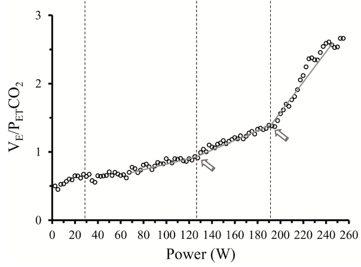

# Uygulama {#Bolum3}

Uygulamada yirmi yapay veri ve onbir gerçek veri kullanılmıştır. Yapay verilerin her biri farklı sayıda değişim noktasına sahip olacak şekilde üretilmiştir. Gerçek veriler ise farklı alanlardan alınmıştır. Verilerin performanslarını belirlemek amacıyla F1 puanı ve kapsama ölçütü kullanılmıştır. Çalışmada R ve Python programlama dilleri kullanılmıştır. Uygulamada kullanılan veriler ve kodlar github sayfasında (https://github.com/eyildiztepe/ChangePointDetection) paylaşılmıştır.

## Veri

Bu bölümde üretilen yapay veriler ve uygulamada kullanılan gerçek veriler hakkında bilgi verilmiştir.

### Yapay Veri

Çalışmada kullanılan yapay veriler farklı sayıda değişim noktasına (DN) sahip olacak şekilde R programlama dili kullanılarak üretilmiştir. Yapay verilerin örneklem genişlikleri, ortalaması 2000, standart sapması 500 olan Normal dağılımndan, verideki değişim noktası sayısı ortalaması 2.8 olan Poisson dağılımından ve DN'lerin konumları ise Uniform dağılımından üretilmiştir. Kullanılan verilerin özellikleri Tablo \@ref(tab:nvar1)'de verilmiştir.


Table: (\#tab:nvar1) Yapay Veriler

| Veri | Gözlem Sayısı | DN Sayısı | DN Konumu                |
|------|---------------|-----------|--------------------------|
| 1    | 1687          | 4         | 516, 578 ,779,1499       |
| 2    | 2092          | 3         | 564,1003,1347            |
| 3    | 1582          | 4         | 175,553,1186,1347        |
| 4    | 2798          | 3         | 951,985,2315             |
| 5    | 2165          | 3         | 1034,1835,1892           |
| 6    | 1590          | 4         | 631,698,1208,1481        |
| 7    | 2244          | 1         | 1578                     |
| 8    | 2369          | 3         | 788,958,1768             |
| 9    | 2288          | 4         | 316,493, 587,1606        |
| 10   | 1847          | 4         | 153,300, 469,1172        |
| 11   | 2756          | 3         | 2119,2168,2377           |
| 12   | 2195          | 5         | 909,1004,1317,1422,1749  |
| 13   | 1689          | 2         | 479,611                  |
| 14   | 893           | 2         | 552,837                  |
| 15   | 2562          | 1         | 575                      |
| 16   | 1978          | 1         | 293                      |
| 17   | 1992          | 2         | 955,1798                 |
| 18   | 2472          | 3         | 1470,1786,2365           |
| 19   | 2411          | 3         | 393,874,1047             |
| 20   | 2297          | 2         | 79,1622                  |


### Gerçek Veri

Çalışmada farklı alanlardan gerçek veriler kullanılmıştır. Veriler (https://github.com/alan-turing-institute/TCPD/tree/master/datasets) adresinden temin edilmiştir. Gerçek verilerin özellikleri Tablo \@ref(tab:ngercek)'de verilmiştir.


Çalışmada kullanılan gerçek veriler 5 ayrı işaretleyici tarafından işaretlenmiştir [@van2020evaluation].Bu nedenle değişim noktası konumları değişiklik göstermektedir .

 
## Değişim Noktası Analizi

Bu bölümde kullanılan yöntemler ile elde edilen sonuçlara yer verilmiştir. Kullanılan fonksiyonların varsayılan ayarları ile elde edilen sonuçlar F1 puanı varsayılan ve kapsama ölçütü varsayılan olarak adlandırılmıştır. Ayrıca, argümanların değerleri değiştirilerek elde edilen en iyi sonuçlar F1 puanı ayarlanmış ve kapsama ölçütü ayarlanmış olarak sunulmuştur.

### Yapay Veriler için Sonuçlar

Bu bölümde yapay veriler için elde edilen sonuçlara yer verilmiştir.

Table: (\#tab:nvar8) F1 puanı (Varsayılan)

| Veri | AMOC   | BINSEG | SEGMENTED | PROPHET | PELT   |
|------|--------|--------|-----------|---------|--------|
| 1    | 0,5714 | 0,9091 | 0,2857    | 0,2857  | 0,4000 |
| 2    | 0,6667 | 0,4000 | 0,3333    | 0,1818  | 0,4444 |
| 3    | 0,5714 | 0,9091 | 0,1290    | 0,2000  | 0,4000 |
| 4    | 0,6667 | 0,8000 | 0,3333    | 0,2222  | 0,7500 |
| 5    | 0,6667 | 0,6000 | 0,4444    | 0,2500  | 0,6666 |
| 6    | 0,5714 | 0,5455 | 0,4000    | 0,1538  | 0,4000 |
| 7    | 0,5000 | 0,2500 | 0,5000    | 0,3333  | 0,5000 |
| 8    | 0,6667 | 0,8000 | 0,5000    | 0,2222  | 0,6000 |
| 9    | 0,2857 | 0,5455 | 0,4000    | 0,1818  | 0,3636 |
| 10   | 0,5714 | 0,7273 | 0,6000    | 0,1666  | 0,4615 |
| 11   | 0,6667 | 0,6000 | 0,5000    | 0,2222  | 0,4444 |
| 12   | 0,5000 | 0,8333 | 0,1666    | 0,1666  | 0,5000 |
| 13   | 0,8000 | 0,6667 | 0,6666    | 0,2857  | 0,5714 |
| 14   | 0,8000 | 0,6667 | 0,6666    | 0,2857  | 0,5714 |
| 15   | 0,9998 | 0,5000 | 0,5000    | 0,4000  | 0,4000 |
| 16   | 0,9999 | 0,5000 | 0,5000    | 0,4000  | 0,4000 |
| 17   | 0,8000 | 0,6667 | 0,6666    | 0,2857  | 0,5714 |
| 18   | 0,6667 | 0,8000 | 0,5000    | 0,2222  | 0,4000 |
| 19   | 0,6667 | 0,8000 | 0,5000    | 0,2222  | 0,4444 |
| 20   | 0,8000 | 0,4444 | 0,3333    | 0,2857  | 0,2857 |

Algoritmalar varsayılan parametre ayarlarıyla çalıştırıldığında (\@ref(tab:nvar8)), yirmi yapay  verinin sekizinde BinSeg, altısında AMOC ve birinde PELT  0,7 ve üzerinde F1 puanına sahipken, parçalı regresyon ve Prophet algoritmasında F1 puanı 0,7 ve üzerinde olan veri bulunmamaktadır.
Varsayılan parametrelerle çalıştırılan algoritmalardan Prophet on yedi, parçalı regresyon üç, AMOC, BinSeg ve Pelt algoritmalarında birer tane 0,3'ün altında F1 puanına sahip veri  bulunmaktadır.

Table: (\#tab:nvar9) Kapsama Ölçütü (Varsayılan)

| Veri | AMOC   | BINSEG | SEGMENTED | PROPHET | PELT   |
|------|--------|--------|-----------|---------|--------|
| 1    | 0,5975 | 0,9895 | 0,3740    | 0,3607  | 0,6843 |
| 2    | 0,5388 | 0,8881 | 0,5185    | 0,5600  | 0,7686 |
| 3    | 0,4937 | 0,9943 | 0,2397    | 0,5151  | 0,7953 |
| 4    | 0,5850 | 0,8989 | 0,4876    | 0,5495  | 0,8897 |
| 5    | 0,7707 | 0,9687 | 0,8126    | 0,6164  | 0,7706 |
| 6    | 0,6079 | 0,8822 | 0,7007    | 0,3625  | 0,5339 |
| 7    | 0,9648 | 0,7995 | 0,7807    | 0,4670  | 0,8523 |
| 8    | 0,6084 | 0,8848 | 0,6725    | 0,6173  | 0,7047 |
| 9    | 0,6629 | 0,9467 | 0,4937    | 0,5129  | 0,6060 |
| 10   | 0,6269 | 0,9288 | 0,7368    | 0,4726  | 0,4510 |
| 11   | 0,8764 | 0,9464 | 0,8185    | 0,9991  | 0,6856 |
| 12   | 0,5639 | 0,8220 | 0,6032    | 0,6158  | 0,5461 |
| 13   | 0,8771 | 0,7478 | 0,8771    | 0,5563  | 0,4660 |
| 14   | 0,8932 | 0,9567 | 0,8911    | 0,4304  | 0,7085 |
| 15   | 0,9992 | 0,9863 | 0,8634    | 0,5091  | 0,4972 |
| 16   | 0,9950 | 0,7715 | 0,8828    | 0,4541  | 0,4058 |
| 17   | 0,8408 | 0,8620 | 0,8403    | 0,5809  | 0,5871 |
| 18   | 0,7744 | 0,9956 | 0,8502    | 0,4184  | 0,4871 |
| 19   | 0,6932 | 0,9925 | 0,7623    | 0,4422  | 0,4285 |
| 20   | 0,5905 | 0,7208 | 0,4578    | 0,4711  | 0,5644 |

Tablo \@ref(tab:nvar9)'daki sonuçlara göre, BinSeg varsayılan parametre ayarlarıyla çalıştırıldığında tüm verilerde 0,7'nin üzerinde kapsama ölçütü değerine sahiptir.  Parçalı regresyon on ikisinde, AMOC dokuzunda, Pelt yedisinde ve Prophet birinde 0,7  ve üzerinde kapsama ölçütü değerine sahip olduğu görülmektedir.

Varsayılan ayarlar çalıştırılan algoritmalardan sadece parçalı regresyonda bir veri 0,3'ün altında kapsama ölçütü değerine sahiptir.

Table: (\#tab:nvar10) F1 Puanı (Ayarlanmış)

| Veri | AMOC   | BINSEG | SEGMENTED | PROPHET | PELT   |
|------|--------|--------|-----------|---------|--------|
| 1    | 0,5714 | 0,9997 | 0,4444    | 0,2500  | 0,6000 |
| 2    | 0,6667 | 0,5000 | 0,5000    | 0,4000  | 0,5000 |
| 3    | 0,5714 | 0,9994 | 0,4000    | 0,2500  | 0,4000 |
| 4    | 0,6667 | 0,9996 | 0,4000    | 0,2500  | 0,7500 |
| 5    | 0,6667 | 0,7500 | 0,4000    | 0,2857  | 0,6666 |
| 6    | 0,5714 | 0,6000 | 0,4000    | 0,3333  | 0,2857 |
| 7    | 0,5000 | 0,5000 | 0,5000    | 0,4000  | 0,5000 |
| 8    | 0,6667 | 0,7500 | 0,5000    | 0,2500  | 0,5454 |
| 9    | 0,2857 | 0,6000 | 0,4000    | 0,2222  | 0,3636 |
| 10   | 0,5714 | 0,8000 | 0,6000    | 0,2000  | 0,6000 |
| 11   | 0,6667 | 0,7500 | 0,5000    | 0,2500  | 0,5714 |
| 12   | 0,5000 | 0,8333 | 0,1666    | 0,3636  | 0,5000 |
| 13   | 0,8000 | 0,9987 | 0,6666    | 0,3333  | 0,6666 |
| 14   | 0,8000 | 0,6667 | 0,6666    | 0,3333  | 0,6666 |
| 15   | 0,9998 | 0,9989 | 0,5000    | 0,5000  | 0,5000 |
| 16   | 0,9999 | 0,9967 | 0,5000    | 0,5000  | 0,5000 |
| 17   | 0,8000 | 0,9985 | 0,6666    | 0,3333  | 0,6666 |
| 18   | 0,6667 | 0,9978 | 0,5000    | 0,2500  | 0,5000 |
| 19   | 0,6667 | 0,9949 | 0,5000    | 0,2500  | 0,5000 |
| 20   | 0,8000 | 0,6667 | 0,3333    | 0,3333  | 0,3333 |

Ayarlanmış parametreler sonucunda en iyi F1 puanı değerleri BinSeg ile elde edilmiştir. Prophet ve parçalı regresyon algoritmalarında hiç bir veri 0,7 ve üzerinde F1 puanına sahip değildir. Pelt algoritmasında bir tane verinin 0,7'nin üzerinde olduğu görülmektedir.

Prophet algoritmasının en kötü F1 puanı değerlerini verdiği görülmektedir. AMOC, parçalı regresyon ve Pelt algoritmalarında 0,3 'ün altında birer tane veri bulunmaktadır.

Table: (\#tab:nvar11) Kapsama Ölçütü (Ayarlanmış)

| Veri | AMOC   | BINSEG | SEGMENTED | PROPHET | PELT   |
|------|--------|--------|-----------|---------|--------|
| 1    | 0,5975 | 0,9930 | 0,9930    | 0,6104  | 0,7081 |
| 2    | 0,5388 | 0,8914 | 0,8914    | 0,6793  | 0,8194 |
| 3    | 0,4937 | 0,9950 | 0,9950    | 0,6152  | 0,9246 |
| 4    | 0,5850 | 0,9957 | 0,9957    | 0,6830  | 0,8840 |
| 5    | 0,7707 | 0,9688 | 0,9688    | 0,7494  | 0,7706 |
| 6    | 0,6079 | 0,8853 | 0,8853    | 0,3967  | 0,5599 |
| 7    | 0,9648 | 0,9648 | 0,9648    | 0,6002  | 0,9670 |
| 8    | 0,6084 | 0,8831 | 0,8831    | 0,6700  | 0,7364 |
| 9    | 0,6629 | 0,9467 | 0,9467    | 0,5665  | 0,6067 |
| 10   | 0,6269 | 0,9092 | 0,9092    | 0,4866  | 0,7201 |
| 11   | 0,8764 | 0,9689 | 0,9689    | 0,9998  | 0,9387 |
| 12   | 0,5639 | 0,8220 | 0,8220    | 0,6338  | 0,5604 |
| 13   | 0,8771 | 0,9976 | 0,9976    | 0,6158  | 0,6509 |
| 14   | 0,8932 | 0,9567 | 0,9567    | 0,5356  | 0,8589 |
| 15   | 0,9992 | 0,9992 | 0,9992    | 0,5255  | 0,8189 |
| 16   | 0,9950 | 0,9950 | 0,9950    | 0,5825  | 0,7296 |
| 17   | 0,8408 | 0,9980 | 0,9980    | 0,7171  | 0,7905 |
| 18   | 0,7744 | 0,9976 | 0,9976    | 0,4701  | 0,6171 |
| 19   | 0,6932 | 0,9983 | 0,9983    | 0,4816  | 0,6680 |
| 20   | 0,5905 | 0,9854 | 0,9854    | 0,5511  | 0,7184 |

Ayarlanan parametreler ile hesaplanan kapsama ölçütü değerinin BinSeg ve parçalı regresyon algoritmalarının tamamında 0,8'in üzerinde olduğu görülmektedir. Pelt için on dört, AMOC için dokuz ve Prophet algortiması için üç verinin 0,7'nin üzerindekapsama ölçütü değerine sahip olduğu görülmektedir.
Ayarlanan parametrelerle çalıştırılan beş farklı algoritmanın kullanıldığı yirmi verinin hiçbirinde 0,3'ün altından kapsama ölçütü değeri bulunmamaktadır.

### Yapay Veriler için Friedman Test 
```{r,echo=FALSE}
if(!require('PMCMRplus')) {
  install.packages('PMCMRplus')
  library('PMCMRplus')
}

sim <- matrix(c(0.5975, 0.5388, 0.4937, 0.5850, 0.7707, 0.6079, 0.9648, 0.6084, 0.6629,
              0.6269, 0.8764, 0.5639, 0.8771, 0.8932, 0.9992, 0.9950, 0.8408, 0.7744,
              0.6932, 0.5905, 0.9930, 0.8914, 0.9950, 0.9957, 0.9688, 0.8853, 0.9648,
              0.8831, 0.9467, 0.9092, 0.9689, 0.8220, 0.9976, 0.9567, 0.9992, 0.9950,
              0.9980, 0.9976, 0.9983, 0.9854, 0.9930, 0.8914, 0.9950, 0.9957, 0.9688,
              0.8853, 0.9648, 0.8831, 0.9467, 0.9092, 0.9689, 0.8220, 0.9976, 0.9567,
              0.9992, 0.9950, 0.9980, 0.9976, 0.9983, 0.9854, 0.6104, 0.6793, 0.6152,
              0.6830, 0.7494, 0.3967, 0.6002, 0.6700, 0.5665, 0.4866, 0.9998, 0.6338,
              0.6158, 0.5356, 0.5255, 0.5825, 0.7171, 0.4701, 0.4816, 0.5511, 0.7081,
              0.8194, 0.9246, 0.8840, 0.7706, 0.5599, 0.9670, 0.7364, 0.6067, 0.7201,
              0.9387, 0.5604, 0.6509, 0.8589, 0.8189, 0.7296, 0.7905, 0.6171, 0.6680,
              0.7184),nrow=20, ncol=5, 
            dimnames=list(1:20,c("AMOC","BinSeg","Parçalı Reg","Prophet","PELT")))

result_sim <- friedman.test(sim)
result_sim
```

\begin{align*}
&H_0:\text{Algoritmalar arasında istatistiksel olarak anlamlı bir fark yoktur.} \\
&H_1:\text{Algoritmalar arasında en az birinde istatistiksel olarak anlamlı bir fark vardır.}
\end{align*}


$p$-değeri 0.05 ($\alpha$)'den küçüktür. Bu nedenle $H_0$ hipotezi reddedilmiştir, algoritmalar arasında en az bir tanesi farklıdır.


#### Yapay Veriler için Nemenyi Test 

```{r,echo=FALSE}

frdAllPairsNemenyiTest(sim, result_sim)
```


- AMOC ve BinSeg algoritmaları arasında istatistiksel olarak anlamlı fark vardır.
- Parçalı Regresyon ve AMOC algoritmaları arasında istatistiksel olarak anlamlı fark vardır.
- Prophet ile BinSeg ve Parçalı Regresyon algoritmaları arasında istatistiksel olarak anlamlı fark vardır.
- PELT ile BinSeg ve Parçalı Regresyon algoritmaları arasında istatistiksel olarak anlamlı fark vardır.


### Gerçek Veriler için Sonuçlar

Bu bölümde gerçek veriler için elde edilen sonuçlara yer verilmiştir.

Table: (\#tab:nvar2) F1 puanı (Varsayılan)

| Veri               | AMOC   | BINSEG | PELT   | SEGMENTED | PROPHET |
|--------------------|--------|--------|--------|-----------|---------|
| Bitcoin            | 0,3670 | 0,4897 | 0,2663 | 0,3670    | 0,2341  |
| Brent-spot         | 0,2718 | 0,6431 | 0,4244 | 0,6590    | 0,3904  |
| Children-per women | 0,6175 | 0,5902 | 0,3366 | 0,8440    | 0,5168  |
| Co2- canada        | 0,5441 | 0,8194 | 0,8194 | 0,3938    | 0,6315  |
| Debt -Ireland      | 0,7603 | 1,0000 | 0,7603 | 0,7603    | 0,6086  |
| Rail-lines         | 0,8462 | 0,8000 | 0,4690 | 1,0000    | 0,2666  |
| Rather-stock       | 0,2718 | 0,3392 | 0,4710 | 0,4886    | 0,5292  |
| Scanline-42049     | 0,4926 | 0,7400 | 0,5151 | 0,2463    | 0,3902  |
| Shangai-license    | 0,8679 | 0,6511 | 0,6666 | 0,6495    | 0,5316  |
| Usd-isk            | 0,7854 | 0,6093 | NA     | 0,7881    | 0,5956  |
| Well-log           | NA     | 0,7289 | 0,4235 | 0,6912    | 0,3589  |

Varsayılan parametre ayarlarıyla algoritmalar çalıştırıldığında, on bir verinin beşinde BinSeg, dördünde AMOC ve parçalı regresyon, ikisinde PELT 0,7 ve üzerinde F1 puanına sahipken Prophet algoritmasında F1 puanı 0,7 ve üzerinde olan veri bulunmamaktadır.

Varsayılan ayarlarda, on bir verinin ikisinde AMOC ve Prophet ile, birinde PELT ve parçalı regresyon ile 0,3'ün altında F1 puanı elde edilmiştir.

BinSeg algoritmasında F1 puanı 0,3 ve altında olan veri bulunmamaktadır.
Değişim noktası tespit edilemeyen durumlar (NA) ile gösterilmiştir.

Table: (\#tab:nvar3) Kapsama Ölçütü (Varsayılan)

| Veri                | AMOC   | BINSEG | PELT   | SEGMENTED | PROPHET |
|---------------------|--------|--------|--------|-----------|---------|
| Bitcoin             | 0,7640 | 0,7354 | 0,3022 | 0,5322    | 0,1941  |
| Brent-spot          | 0,4251 | 0,5921 | 0,4535 | 0,4945    | 0,2992  |
| Children-per women  | 0,7838 | 0,7663 | 0,7721 | 0,6282    | 0,2753  |
| Co2- canada         | 0,5264 | 0,7291 | 0,7393 | 0,5135    | 0,3409  |
| Debt -Ireland       | 0,5844 | 0,6607 | 0,5446 | 0,5861    | 0,4000  |
| Rail-lines          | 0,7682 | 0,7732 | 0,4408 | 0,7890    | 0,3081  |
| Rather-stock        | 0,3870 | 0,3923 | 0,3970 | 0,5164    | 0,3470  |
| Scanline-42049      | 0,4305 | 0,7502 | 0,4157 | 0,3859    | 0,3249  |
| Shangai-license     | 0,9105 | 0,7691 | 0,3132 | 0,8272    | 0,2458  |
| Usd-isk             | 0,8577 | NA     | NA     | 0,5248    | 0,2752  |
| Well-log            | 0,4527 | 0,7696 | 0,4285 | 0,4146    | 0,3743  |

Varsayılan ayarlar ile, on bir verinin yedisinde BinSeg, beşinde AMOC,  ikisinde PELT ve parçalı regresyon ile 0,7 ve üzerinde kapsama ölçütü değerleri elde edilmiştir.

Prophet algoritmasında hiçbir veri için kapsama ölçütü değeri  0,7 nin üzerinde değildir.
Varsayılan ayarlar ile Prophet algoritmasında başarılı kapsama ölçütü değerleri elde edilemediği görülmektedir. Prophet on bir verinin beşinde 0,3 ve altında kapsama ölçütü değerine sahiptir.
Değişim noktası tespit edilemeyen durumlar (NA) ile gösterilmiştir.

Table: (\#tab:nvar4) F1 Puanı (Ayarlanmış)

| Veri                | AMOC   | BINSEG | PELT   | SEGMENTED | PROPHET |
|---------------------|--------|--------|--------|-----------|---------|
| Bitcoin             | 0,3670 | 0,6124 | 0,3940 | 0,4523    | 0,2743  |
| Brent-spot          | 0,2718 | 0,6341 | 0,4481 | 0,6590    | 0,3704  |
| Children-per women  | 0,6175 | 0,5902 | 0,6388 | 0,8440    | 0,5168  |
| Co2- canada         | 0,5441 | 0,8776 | 0,3595 | 0,7142    | 0,6045  |
| Debt -Ireland       | 0,7603 | 0,9583 | 0,9583 | 0,9795    | 0,9795  |
| Rail-lines          | 0,8461 | 0,8316 | 0,7234 | 0,9655    | 0,9655  |
| Rather-stock        | 0,2718 | 0,3728 | 0,5316 | 0,4243    | 0,5292  |
| Scanline-42049      | 0,4926 | 0,8331 | 0,5704 | 0,8648    | 0,4581  |
| Shangai-license     | 0,8679 | 0,6511 | 0,2025 | 0,6495    | 0,5316  |
| Usd-isk             | 0,7854 | 0,6093 | 0,6007 | 0,7881    | 0,5956  |
| Well-log            | 0,2791 | 0,7289 | 0,5760 | 0,6912    | 0,3589  |

Ayarlanmış parametreler ile en iyi F1 puanı değerleri parçalı regresyon ile alınmıştır. On bir veri setinin altısında parçalı regresyon, beşinde BinSeg, dördünde AMOC,  ikisinde PELT ve Prophet'in 0,7 ve üzerinde F1 puanına sahip olduğu görülmektedir.

Tablo \@ref(tab:nvar4)'e göre parçalı regresyon ve BinSeg algoritmaları denenen tüm gerçek veriler için 0,3 ve üzerinde F1 puanı elde etmişlerdir.  Ancak AMOC algoritması için F1 puanı  onbir verinin üçünde 0,3'ün altındadır.

Table: (\#tab:nvar5) Kapsama Ölçütü (Ayarlanmış)

| Veri                | AMOC   | BINSEG | PELT   | SEGMENTED | PROPHET |
|---------------------|--------|--------|--------|-----------|---------|
| Bitcoin             | 0,7640 | 0,4352 | 0,2182 | 0,3833    | 0,2045  |
| Brent-spot          | 0,4251 | 0,4858 | 0,3257 | 0,5273    | 0,3206  |
| Children-per women  | 0,7938 | 0,7625 | 0,7635 | 0,7062    | 0,3485  |
| Co2- canada         | 0,5264 | 0,7001 | 0,7494 | 0,6622    | 0,4366  |
| Debt -Ireland       | 0,5844 | 0,8136 | 0,7042 | 0,8217    | 0,6919  |
| Rail-lines          | 0,7665 | 0,7731 | 0,5113 | 0,6964    | 0,6222  |
| Rather-stock        | 0,3870 | 0,3941 | 0,4840 | 0,4488    | 0,3470  |
| Scanline-42049      | 0,4305 | 0,8570 | 0,4157 | 0,7944    | 0,4097  |
| Shangai-license     | 0,9105 | 0,7961 | 0,3955 | 0,8058    | 0,3625  |
| Usd-isk             | 0,8577 | 0,7549 | 0,5609 | 0,7819    | 0,4211  |
| Well-log            | 0,4527 | 0,6371 | 0,4873 | 0,5511    | 0,4615  |

Ayarlanmış parametreler ile algoritmalar çalıştırıldığında, kapsama ölçütüne göre en iyi sonuçları BinSeg algoritması vermiştir. Denenen on bir verinin yedisinde BinSeg, beşinde AMOC ve parçalı regresyon, üçünde PELT 0,7 ve üzerinde kapsama metriğine sahipken Prophet algoritmasında kapsama metriği 0,7 ve üzerinde olan veri bulunmamaktadır.

Çalışmada incelenen algoritmaların ihtiyaç duyduğu parametre değerleri verilere göre en uygun hale getirildiğinde BinSeg ve parçalı regresyon algoritmalarının diğerlerine göre değişim noktalarının konumlarını belirlemede daha başarılı olduğu görülmüştür.

### Gerçek Veriler için Friedman Test 
```{r,echo=FALSE}
if (!require('PMCMRplus')) {
  install.packages('PMCMRplus')
  library('PMCMRplus')
}

# Define the data matrix
real <- matrix(c(0.7640, 0.4251, 0.7938, 0.5264, 0.5844, 0.7665, 0.3870, 0.4305, 0.9105,
                 0.8577, 0.4527, 0.4352, 0.4858, 0.7625, 0.7001, 0.8136, 0.7731, 0.3941,
                 0.8570, 0.7961, 0.7549, 0.6371, 0.2182, 0.3257, 0.7635, 0.7494, 0.7042,
                 0.5113, 0.4840, 0.4157, 0.3955, 0.5609, 0.4873, 0.3833, 0.5273, 0.7062,
                 0.6622, 0.8217, 0.6964, 0.4488, 0.7944, 0.8058, 0.7819, 0.5511, 0.2045,
                 0.3206, 0.3485, 0.4366, 0.6919, 0.6222, 0.3470, 0.4097, 0.3625, 0.4211,
                 0.4615), nrow = 11, ncol = 5, 
               dimnames = list(c("Bitcoin", "Brent-spot", "childeren-per women", "co2- canada", "debt -Ireland", "rail-lines", "rather-stock", "scanline-42049", "shangai-license", "usd-isk", "well-log"),
                               c("AMOC","BinSeg","PELT","Parçalı Reg","Prophet")))

# Perform Friedman test
result_real <- friedman.test(real)
print(result_real)
```

\begin{align*}
& H_0:\text{Algoritmalar arasında istatistiksel olarak anlamlı bir fark yoktur.} \\
& H_1:\text{Algoritmalar arasında en az birinde istatistiksel olarak anlamlı bir fark vardır.}
\end{align*}

$p$-değeri 0.05 ($\alpha$)'den küçüktür. Bu nedenle $H_0$ hipotezi reddedilmiştir, algoritmalar arasında en az bir tanesi farklıdır.

#### Gerçek Veriler için Nemenyi Test 
```{r,echo=FALSE}
if(!require('PMCMRplus')) {
  install.packages('PMCMRplus')
  library('PMCMRplus')
}

nemenyi_result <- frdAllPairsNemenyiTest(real, result_real)
print(nemenyi_result)
```
Prophet ile AMOC, BinSeg ve parçalı regresyon algoritmaları arasında istatistiksel olarak anlamlı bir fark vardır.

## Kademeli Egzersiz Test Verileri

Bu bölümde 15 sporcunun kademeli bir rampa testi sonucunda elde edilen veriler kullanılarak eşik egzersiz şiddetlerini değişim noktası belirleme yöntemleri ile tespit etmek denenmiştir.

```{r, echo=FALSE,fig.cap="$V_E/P_{ET}CO_2$ - Power (W)" ,out.width="302px", out.height="228px"}

```

$V_E/P_{ET}CO_2$ :Dakika ventilasyonu bölü ekspirasyon sonu $CO_2$ kısmi basıncı [@hakan2022solunumsal]

Power(W) :Egzersiz şiddeti [@hakan2022solunumsal]

Table: (\#tab:nvar6) Kapsama Ölçütü (Ayarlanmış)

| Veri | BINSEG | SEGMENTED | PELT  |
|------|--------|-----------|-------|
| 1    | 0,7023 | 0,6688    | 0,7340|
| 2    | NA     | 0,8232    | NA    |
| 3    | NA     | 0,5097    | NA    |
| 4    | 0,7485 | 0,9547    | 0,7308|
| 5    | 0,9326 | 0,8972    | 0,7314|
| 6    | NA     | 0,7793    | NA    |
| 7    | NA     | 0,9493    | NA    |
| 8    | 1,0000 | 0,8930    | 0,8425|
| 9    | 0,8181 | 0,9545    | 0,8723|
| 10   | 0,8039 | 0,6843    | 0,7189|
| 11   | 1,0000 | 0,6111    | 0,5965|
| 12   | 1,0000 | 0,7270    | 0,9353|
| 13   | 0,6520 | 0,8486    | 0,9805|
| 14   | 0,5434 | 0,7423    | 1,0000|
| 15   | 0,7141 | 0,4571    | 0,8194|

Ayarlanan parametreler ile hesaplanan kapsama ölçütü değerinin parçalı regresyon algoritmasında yedi, Pelt ve BinSeg algoritmalarında ise altı veride 0,8'in üzerinde olduğu görülmektedir.
Ayarlanan parametrelerle çalıştırılan üç farklı algoritmanın kullanıldığı on beş verinin hiçbirinde 0,3'ün altından kapsama ölçütü değeri bulunmamaktadır.

İki değişim noktası tespit edilemeyen durumlar (NA) ile gösterilmiştir.

Table: (\#tab:nvar7) F1 Puanı (Ayarlanmış)

| Veri | BINSEG | SEGMENTED | PELT  |
|------|--------|-----------|-------|
| 1    | 0,6600 | 0,6600    | 0,6600|
| 2    | NA     | 1,0000    | NA    |
| 3    | NA     | 0,6600    | NA    |
| 4    | 1,0000 | 1,0000    | 1,0000|
| 5    | 1,0000 | 1,0000    | 1,0000|
| 6    | NA     | 1,0000    | NA    |
| 7    | NA     | 1,0000    | NA    |
| 8    | 1,0000 | 1,0000    | 1,0000|
| 9    | 0,8571 | 0,8571    | 1,0000|
| 10   | 1,0000 | 1,0000    | 1,0000|
| 11   | 0,7499 | 0,8571    | 0,8571|
| 12   | 1,0000 | 1,0000    | 1,0000|
| 13   | 0,5714 | 0,8571    | 1,0000|
| 14   | 0,2857 | 0,8571    | 1,0000|
| 15   | 0,2857 | 0,4615    | 0,6600|

Ayarlanmış parametreler sonucunda en iyi F1 puanı değerleri parçalı regresyon ile elde edilmiştir. Parçalı regresyon algoritmasında on iki veri 0,8 ve üzerinde F1 puanına sahiptir. Pelt algoritmasında dokuz, BinSeg algoritmasında ise altı verinin 0,8'in üzerinde F1 puanına sahip olduğu görülmektedir.

Pelt ve parçalı regresyon  algoritmalarının 0,3'ün altında  F1 puanı yokken, BinSeg algoritmasında ise iki veride 0,3'ün altında F1 puanı elde edilmiştir.

İki değişim noktası tespit edilemeyen durumlar (NA) ile gösterilmiştir.

### Kademeli Egzersiz Test Verileri için Friedman Test 

```{r,echo=FALSE}
if(!require('PMCMRplus')) {
  install.packages('PMCMRplus')
  library('PMCMRplus')
}

ve_petco2 <- matrix(c(0.7023, NA, NA, 0.7485, 0.9326, NA, NA, 1.0000, 0.8181, 0.8039,
                1.0000, 1.0000, 0.6520, 0.5434, 0.7141,
                0.6688, 0.8232, 0.5097, 0.9547, 0.8972, 0.7793, 0.9493, 0.8930,
                0.9545, 0.6843, 0.6111, 0.7270, 0.8486, 0.7423, 0.4571,
                0.7340, NA, NA, 0.7308, 0.7314, NA, NA, 0.8425, 0.8723, 0.7189,
                0.5965, 0.9353, 0.9805, 1.0000, 0.8194),
              nrow = 15, ncol = 3,
              dimnames = list(1:15, c("BinSeg", "Parcali_Regresyon", "PELT")))
result <- friedman.test(ve_petco2)
result
```

\begin{align*}
& H_0:\text{Algoritmalar arasında istatistiksel olarak anlamlı bir fark yoktur.} \\
& H_1:\text{Algoritmalar arasında en az birinde istatistiksel olarak anlamlı bir fark vardır.}
\end{align*}


$p$-değeri 0.05 ($\alpha$)'den büyüktür. Bu nedenle $H_0$ hipotezi reddedilememiştir, algoritmalar arasında istatistiksel olarak anlamlı bir fark yoktur.